<!-- ╔═══════════════════════════════════════════════════════════════╗
     ║   GHOST EMPIRE · profile README — black & red "Netflix" theme  ║
     ╚═══════════════════════════════════════════════════════════════╝ -->

  

## ▶ &nbsp; ABOUT THIS ORIGINAL

<table>
<tr><td width="62%" valign="top">

> **GHOST EMPIRE** is a one-person studio building a full vertical stack —
> from a **memory-safe operating system in Rust** all the way up to
> **Minecraft server infrastructure**, **Discord platforms** and
> **live-streaming tooling**.
>
> Everything is shipped under the **`E-` / Empire** brand: opinionated,
> hardened, and built to run in production. Polished black-and-red, always. 🔴⚫

- 🦀 &nbsp;**Systems / OS** — `E-OS`, a hardened microkernel OS (Rust, Redox downstream)
- 🟪 &nbsp;**Minecraft infra** — a full plugin suite (Kotlin / Java, PacketEvents)
- 🟦 &nbsp;**Web & bots** — Next.js · Supabase · Vercel · discord.js
- 🎥 &nbsp;**Streaming** — custom OBS build + creator economy (Ghost Tokens)
- 🎯 &nbsp;**Now forging** — anticheat checks, multi-tenant bot SaaS, Hytale core

</td><td width="38%" valign="top" align="center">

</td></tr>
</table>

## 🎬 &nbsp; GHOST EMPIRE ORIGINALS

### 🦀 &nbsp; SERIES 1 — “E-OS UNIVERSE” &nbsp;·&nbsp; Rust Systems

| Title | Stack | Status |
|---|---|---|
| **[E-OS](https://github.com/Gh0s777tt/E-OS)** — modern memory-safe microkernel OS, hardened AGPL downstream of Redox | `Rust` · `C` · `Asm` · `QEMU` · `x86-64` | 🟢 Public |
| **[eos-kernel](https://github.com/Gh0s777tt/eos-kernel)** — aarch64 `FEAT_RNG` emulation + shared PCIe INTx IRQ fixes | `Rust` | 🟢 Public |
| **[eos-base](https://github.com/Gh0s777tt/eos-base)** — aarch64 `nvmed` INTx interrupt-mode fix | `Rust` | 🟢 Public |
| **[eos-relibc](https://github.com/Gh0s777tt/eos-relibc)** — relibc downstream, aarch64 `verify()` fix | `Rust` · `C` | 🟢 Public |
| **[eos-bootloader](https://github.com/Gh0s777tt/eos-bootloader)** · **[eos-userutils](https://github.com/Gh0s777tt/eos-userutils)** · **[eos-orbdata](https://github.com/Gh0s777tt/eos-orbdata)** — red/black boot, login & branding | `Rust` · `Asm` | 🟢 Public |

### 🟦 &nbsp; SERIES 2 — “GHOST EMPIRE PLATFORM” &nbsp;·&nbsp; Web · Bots · Streaming

| Title | Stack | Status |
|---|---|---|
| **E-Bot** — Discord bot + **Netflix-style game library** + dashboard (IGDB, Twitch/Kick/YouTube), anti-nuke | `TypeScript` · `Next.js` · `Supabase` · `Vercel` · `Docker` | 🔒 Private |
| **ghost-empire** — community portal for streamer *Gh0s77tt*, creator economy w/ **Ghost Tokens** | `TypeScript` · `Next.js` · `Docker` | 🔒 Private |
| **[empire-OBS](https://github.com/Gh0s777tt/empire-OBS)** — custom OBS Studio build for the Empire stream | `C` · `C++` · `Swift` · `Lua` | 🟢 Public |
| **Project-Beta** — next Empire title *(in development)* | `C#` | 🔒 Private |

### 🟪 &nbsp; SERIES 3 — “EMPIRE for MINECRAFT” &nbsp;·&nbsp; Server Infrastructure

| Title | Stack | Status |
|---|---|---|
| **E-Anticheat** — modular server anticheat, **17 zero-FP checks**, bans/trust, Hytale-ready core | `Kotlin` · `PacketEvents` · `Paper` | 🔒 Proprietary |
| **E-Vault** — `VaultUnlocked` rewrite: Chat / Permissions / Economy abstraction (Bukkit→Folia) | `Kotlin` · `Gradle` | 🔒 Private |
| **E-WorldGuard** · **E-WorldEdit** — region protection & world editing | `Java` · `Kotlin` | 🔒 Private |
| **E-ProtocolLib** · **E-PlaceholderAPI** — packet & placeholder backbone | `Java` | 🔒 Private |
| **E-Auth** — authentication / login security | `Java` | 🔒 Private |
| **E-Chat** — chat engine | `Kotlin` | 🔒 Private |
| **[E-WorldBorder](https://github.com/Gh0s777tt/E-WorldBorder)** · **[Nemesis](https://github.com/Gh0s777tt/Nemesis)** — world border & server core | `Kotlin` | 🟢 Public |

## 🎞️ &nbsp; GENRES &nbsp;·&nbsp; Tech Stack

**Languages**

**Frameworks & Platforms**

**Tooling**

## 📊 &nbsp; THE NUMBERS

&nbsp;

  

## 🏆 &nbsp; AWARDS & BADGES

🎖️ &nbsp;GitHub-native achievements (Pull Shark, Quickdraw, YOLO…) render on the profile sidebar automatically.

## 🐍 &nbsp; CONTRIBUTION GRAPH

<picture>
  <source media="(prefers-color-scheme: dark)" srcset="https://raw.githubusercontent.com/Gh0s777tt/Gh0s777tt/output/github-snake-dark.svg"/>
  <source media="(prefers-color-scheme: light)" srcset="https://raw.githubusercontent.com/Gh0s777tt/Gh0s777tt/output/github-snake-dark.svg"/>
  
</picture>

## 📡 &nbsp; CONNECT · WATCH · SUPPORT

  

💳 Cards · 🏦 Transfer · 📱 BLIK · 🅿️ PayPal · ₿ Crypto · 🔄 Revolut &nbsp;—&nbsp; <b><a href="https://donatr.ee/ghost77/">donatr.ee/ghost77</a></b>

 

<i>Black. Red. Production-grade. — © GHOST EMPIRE · Empire Forge</i>

